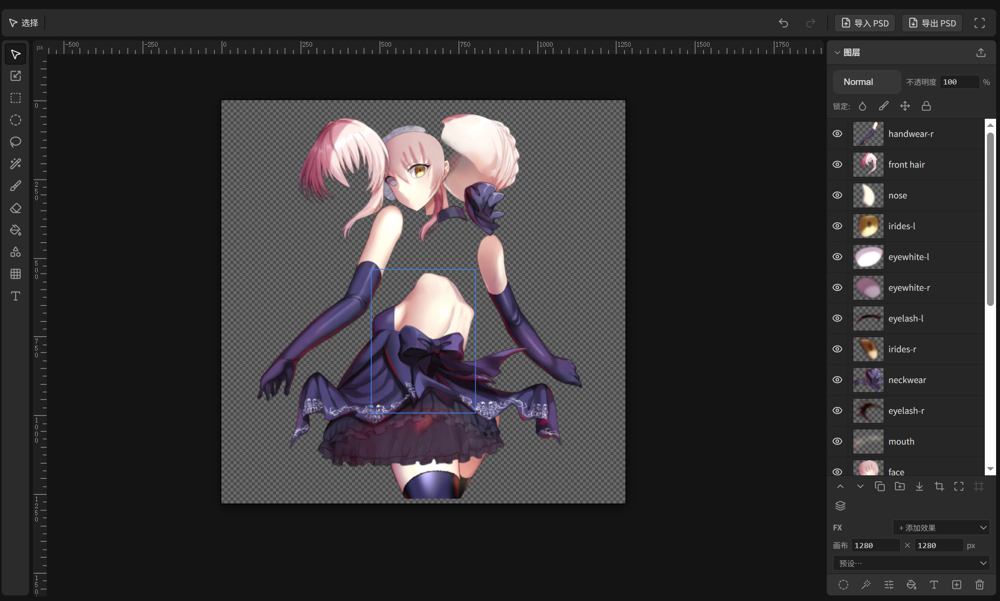

# Pentrado

**▶ Try it in your browser: [pentrado.com](https://pentrado.com)** — no install, your document persists locally.

A layered raster/vector image editor for the web — the class of tool occupied by
GIMP, Photoshop and Photopea, built as an embeddable library. Pentrado is developed
alongside [ComfyTV](https://github.com/jtydhr88/ComfyTV) (where it powers the Layer
Editor and Storyboard stages) but has no dependency on ComfyUI or ComfyTV: everything
the editor needs from its surroundings goes through the `PentradoHost` interface.



## Layout

- `src/engine/` — pure TypeScript core: scene-graph document model (raster /
  text / vector / adjustment / fill / group nodes, masks), command-based undo
  history, selection model, tools, painting, WebGL compositor with full blend
  mode set, non-destructive layer fx, PSD-grade adjustment math.
- `src/ui/` — Vue 3 components and composables: canvas viewport, tool bar and
  tool strip, layer panel, text editing popup, hotkeys.
- `src/primitives/` — self-contained form controls used by the UI (select,
  slider with gradient track, curves editor).
- `src/host.ts` — the embedding contract. Uploads, downloads, notifications,
  i18n, font resources, media-library export and asset picking are all provided
  by the host. Every hook is optional; built-in fallbacks (object-URL uploads,
  English strings, plain file drop) keep the editor fully functional standalone.
- `src/locales/` — UI strings (`pentrado.*` namespace) for en/zh, exported for
  merging into a host vue-i18n instance.
- PSD import/export (`psdImport.ts` / `psdExport.ts`), text shaping via a
  vendored Typr (`vendor/typr`), font store, filters, pan/zoom.

## Embedding sketch

```ts
import {
  useLayerEditorStage, providePentradoHost,
  LayerEditorCanvas, LayerEditorToolBar, LayerListPanel,
  type PentradoHost, type LayerEditorStorage,
} from '@jtydhr88/pentrado'

const host: PentradoHost = { uploadBlob, notify, t, /* … */ }
const storage: LayerEditorStorage = { /* persist document JSON somewhere */ }

providePentradoHost(host)
const editor = useLayerEditorStage({ storage, host })
// render <LayerEditorCanvas :editor="editor" /> etc.
```

The i18n contract: templates use `$t('pentrado.…')`, so the host app installs
vue-i18n and merges `messages` from `@jtydhr88/pentrado/locales`.

## Repository layout & workflow

This repo is the source of truth for Pentrado. `src/` is the engine +
UI (with its tests), `site/` is pentrado.com (the standalone editor
with IndexedDB persistence).

- `npm run dev` — local editor at the vite dev URL
- `npm test` / `npm run typecheck` — engine + UI suites
- `npm run build` / `npm run deploy` — build `dist/` and publish to
  Cloudflare Pages (production)

ComfyTV consumes a synced copy: in the ComfyTV repo,
`npm run pentrado:sync` mirrors this repo's `src/` into
`packages/pentrado/src`, then run ComfyTV's own typecheck/tests/build
to confirm nothing downstream broke.